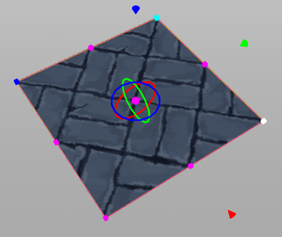

# UV Tool Suite for Blender

A set of tools to make editing UVs easier in Blender.

### UV Brush

Adjust the UVs on your mesh by stroking your model with a brush.

##### UV Brush
Start the UV Brush tool.

##### Radius
Radius of brush stroke.  You can also press the **[** and **]** keys to change the radius of the brush.

##### Strength
Multiplier for the strength of your brush stroke.

##### Pen Pressure
If checked, the pressure you apply with your stylus will multiply the strength of your brush.

### UV Plane Projection

Creates a control that allows you to perform a UV planar projection in the viewport.

Click and drag handles to resize, translate or rotate the control.  Hold **shift** when dragging scale handles for uniform scaling.  Hold **control** when rotating to snap rotations to increments of 15 degrees.

##### UV Plane Project
Start the plane project tool.

##### Selected Faces Only
If checked, only faces selected on your mesh will be affected by the control.

##### Step by UVs
If checked, when dragging the translation handles of the control, the UV adjustment will be snapped to multiples of the **Step UV Scalar**.

##### Step UV Scalar
When **Step by UVs** is enabled, specifies the snapping distance in UV space.

##### Start Mode
Defines how the control should be initialized when the **Uv Plane Project** button is pressed.

- **Bounds** - Control aligns to the bounding box of your mesh.
- **Face** - Control will attempt to match the existing UVs of the active face.
- **Grid** - Control will match a single grid square.

### Copy Symmetric UVs

Copy UVs to faces that are reflected across an axis.  For every selected face, this tool will check if a mirror image exists of it on the other side of the axis.  If so, the UVs of the selected side are copied to the unselected side.  If both are selected, the positive side of the axis is copied to the negative side.

##### Axis
Axis to reflect UVs across.

##### Epsilon
How close vertices need to be to be considered overlapping.  The reflected face's vertices must be within this tolerance of the source face's vertices.

### Triplanar Projection

Perform a cubemap projection based on the grid coorinates.

##### Use Grid Scale
If true, the current scale factor of the grid will be applied to the projection.  Otherwise the layout will be done with absolute values.

##### Uniform Scale
If true, u and v axes will be scaled uniformly.  Otherwise scaling for each axis can be specified separately.

##### U Scale
Multiplier for U coorinate.

##### V Scale
Multiplier for V coorinate.

### Correct Face Attributes

This is the same attribute that Blender provides under the Tool/Options/Correct Face Attributes when in Edit mode.  It is duplicated here for convenience.

## Building

To build, execute the *makeDeploy.py* script in the root of the project.  It will create a directory called *deploy* that contains a zip file containing the addon.

## Installation

To install, start Blender and select Edit > Preferences from the menubar.  Select the Add-ons tab and then press the Install button.  Browse to the .zip file that you built and select it.  Finally, tick the checkbox next to Add Mesh: Normal Brush.

## Further Information

This addon is available from the Blender market:

https://blendermarket.com/products/uv-tools

A video giving a quick tour of the addon is available here:

